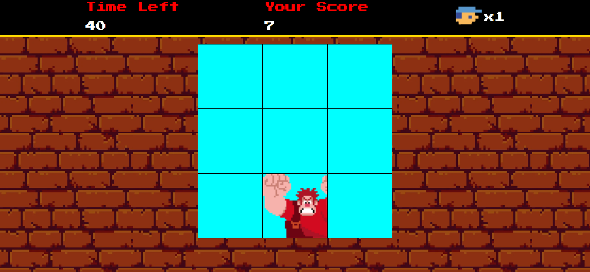

# Jogo Detona Ralph

## Projeto

Projeto criado na Digital Innovation One (DIO) utilizando somente HTML, CSS e JavaScript.  

## Correções

-Corrigido o cronômetro do tempo restante de jogo, onde o mesmo não reiniciava quando o jogo acabava;

-Corrigido a quantidade total de pontos, onde o mesmo não zerava quando o jogo acabava.

## Adições

-Adicionada funcionalidade de subtrair vidas quando errado o Ralph e de zerar o jogo quando as vidas chegam ao final;

## Conheça mais dos meus projetos

Me adicione no Linkedin :point_right: [Leonardo Abdala](https://www.linkedin.com/in/leonardo-abdala/) e no Github, vamos desenvolver juntos. :facepunch:

Projeto DIO no link [Link do projeto original DIO](https://github.com/digitalinnovationone/jsgame-detona-ralph).

